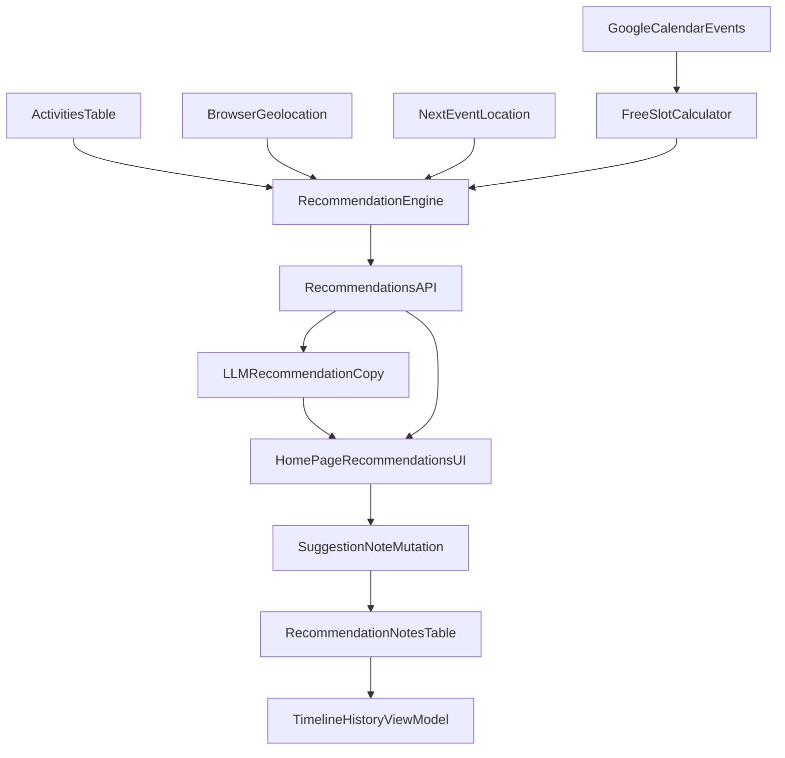

# Activity Recommendation MVP Plan

## Confirmed scope (from your choices)
- Activity source: use DB-backed `activities` with time + location filtering.
- Free-time window: only between configurable day bounds (default 9AM–9PM).
- Free-slot rule: apply fixed 15-minute buffer around calendar events.
- Location logic: use browser geolocation as primary current location; also use next event location if available.
- Ranking logic: simple duration-fit and time/location filters (no complex ML scoring yet).
- UI polish for demo: use native CSS + Tailwind transitions (no animation library dependency).
- Multi-recommendation behavior: return multiple suggestions per free slot.
- Interaction for demo: prioritize note capture on suggestion click (journal/timeline seed).
- LLM usage for demo: generate catchy/appealing recommendation copy text; keep recommendation ranking deterministic.

## MVP architecture

## File-level implementation plan

### 1) Add scheduling/recommendation constants
- Create [`/Users/aditya/projects/personal/memento/src/lib/recommendation-config.ts`](/Users/aditya/projects/personal/memento/src/lib/recommendation-config.ts).
- Include configurable constants:
  - `DAY_START_HOUR = 9`
  - `DAY_END_HOUR = 21`
  - `EVENT_BUFFER_MINUTES = 15`
  - `MAX_RECOMMENDATIONS_PER_SLOT` (demo-safe cap, e.g. 3-5)
- Keep all recommendation/free-slot modules importing from this single config.

### 2) Build free-slot calculation module
- Create [`/Users/aditya/projects/personal/memento/src/lib/free-slots.ts`](/Users/aditya/projects/personal/memento/src/lib/free-slots.ts).
- Inputs:
  - normalized calendar events (`GoogleCalendarEvent` from [`/Users/aditya/projects/personal/memento/src/lib/google-calendar.ts`](/Users/aditya/projects/personal/memento/src/lib/google-calendar.ts))
  - date, day-bound constants, buffer minutes
- Outputs:
  - free slots with `{ startIso, endIso, durationMinutes, nextEventId? }`
- Rules:
  - clamp to 9AM–9PM range
  - expand busy intervals with 15-min buffers
  - merge overlaps
  - derive gaps as free slots
  - ignore tiny slots (< minimum activity duration threshold)

### 3) Add recommendation engine module
- Create [`/Users/aditya/projects/personal/memento/src/lib/recommend-activities.ts`](/Users/aditya/projects/personal/memento/src/lib/recommend-activities.ts).
- Inputs:
  - free slots
  - active activities from DB (`activities` table in [`/Users/aditya/projects/personal/memento/src/server/db/schema.ts`](/Users/aditya/projects/personal/memento/src/server/db/schema.ts))
  - current geolocation (browser)
  - optional next-event location
- Filtering/scoring (simple MVP):
  - time-of-day match (`activities.timeOfDay`)
  - day/date match (`days`, `specificDates`)
  - duration fit (`minDurationMinutes`, `maxDurationMinutes`)
  - location fit (`latitude`/`longitude` with `radiusMeters` when present)
  - priority tie-break (`priority`, then deterministic fallback)
- Output per slot:
  - list of ranked recommendations (more than one)

### 4) Add persistence for note interaction
- Extend [`/Users/aditya/projects/personal/memento/src/server/db/schema.ts`](/Users/aditya/projects/personal/memento/src/server/db/schema.ts) with a new table for recommendation note actions (e.g. `recommendation_notes`).
- MVP columns:
  - `id`, `userId`, `activityId`, `slotStartIso`, `slotEndIso`, `note`, `createdAt`
- Keep it focused on your selected behavior (note capture on suggestion click).
- Generate/apply migration after schema change.

### 5) Expose server API via tRPC
- Add router [`/Users/aditya/projects/personal/memento/src/server/api/routers/recommendations.ts`](/Users/aditya/projects/personal/memento/src/server/api/routers/recommendations.ts).
- Procedures:
  - `getForToday` (query): fetch calendar events, compute free slots, query activities, run recommendation engine, then attach catchy recommendation text (LLM if available, fallback template copy), and return slot→recommendations payload.
  - `saveNote` (mutation): persist note for clicked suggestion.
- Register router in [`/Users/aditya/projects/personal/memento/src/server/api/root.ts`](/Users/aditya/projects/personal/memento/src/server/api/root.ts).

### 6) Add LLM copy-generation helper (non-blocking)
- Create [`/Users/aditya/projects/personal/memento/src/lib/recommendation-copy.ts`](/Users/aditya/projects/personal/memento/src/lib/recommendation-copy.ts).
- Responsibility:
  - build concise, catchy one-liner copy per recommendation based on slot duration, timing, and location context.
  - if LLM call fails/timeout, return deterministic template text (so demo flow never breaks).
- Guardrails:
  - never change ranking order; copy generation is presentation-only.
  - keep response short and avoid hallucinated facts (only use provided recommendation fields).

### 7) Integrate UI on home page for demo flow
- Update [`/Users/aditya/projects/personal/memento/src/app/page.tsx`](/Users/aditya/projects/personal/memento/src/app/page.tsx).
- Add recommendation section per free slot:
  - show slot time range + duration
  - show multiple suggestion cards
  - show catchy recommendation copy text on each card
  - each card supports click to open note input (inline or modal)
  - save note via `saveNote` mutation
- Show simple optimistic feedback message after note save.
- Add animation polish using Tailwind/native CSS only:
  - card enter transitions (`transition`, `duration`, `ease`)
  - loading skeleton pulse (`animate-pulse`)
  - subtle hover/focus transitions for recommendation cards

### 8) Demo-ready resilience/fallbacks
- If geolocation denied/unavailable:
  - continue with next-event location-only filtering.
  - if neither location exists, continue with non-location filters so UI still shows recommendations.
- If LLM unavailable/errors:
  - return fallback template copy and continue rendering recommendations.
- If no free slots:
  - show explicit empty state.
- If no matching activities:
  - show slot with “no good match yet” and keep app stable.

### 9) Verification and demo checklist
- Validate type/lint after edits:
  - `bun run check`
  - `bun run typecheck`
- Manual walkthrough:
  - signed-in user with calendar connected
  - busy blocks visible
  - free slots computed in 9AM–9PM with 15-min buffers
  - multiple suggestions per slot
  - recommendation cards animate smoothly with Tailwind transitions
  - catchy recommendation copy appears even when LLM is unavailable (fallback text)
  - click suggestion, enter note, save note successfully

## 1-hour execution sequence (to stay demo-safe)
- 0-15 min: constants + free-slot module.
- 15-30 min: recommendation engine with DB filters.
- 30-42 min: tRPC query/mutation + schema table.
- 42-52 min: LLM/fallback copy helper integration.
- 52-60 min: home page UI wiring (Tailwind transitions) + note capture + smoke test.

## Explicitly deferred after demo
- Dismiss-based feedback persistence.
- Image attachments in notes.
- Learned personalization/reranking from interaction history.
- Automatic calendar writeback for accepted recommendations.