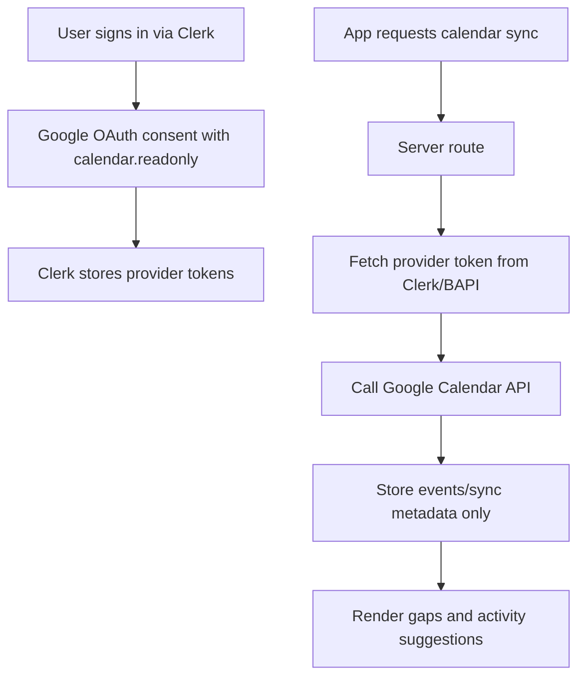

# Data Model Foundation Plan

## Decisions captured
- Use **internal numeric primary keys** and **public string IDs** (`usr_...`, `act_...`) for external references.
- Keep `users.clerkUserId` as a required unique mapping to Clerk.
- Use **Clerk-managed Google OAuth** for Calendar access; do not persist raw access/refresh tokens in app DB.
- Replace `google_calendar_creds` with **connection/sync metadata only** (`calendarConnected`, status, scopes, sync timestamps/errors).
- Omit `username` in v1.
- Use a **hybrid activity model** with one `activities` table: `sourceType` (`curated` | `user`) + nullable `createdByUserId`.
- Keep v1 defaults unless later changed: `days` includes `any`, `specificDates` is `date[]`, and time interpretation is user-local timezone.

## Skill usage instruction (for implementation phase)
- Before implementing any Clerk auth/OAuth/calendar integration work, first use [`/Users/aditya/projects/personal/memento/.agents/skills/clerk/SKILL.md`](/Users/aditya/projects/personal/memento/.agents/skills/clerk/SKILL.md) to route to the right Clerk subskill/pattern.
- If no suitable Clerk skill exists (or coverage is incomplete), run the **`find-skills`** skill to discover relevant skills.
- If a new skill is recommended, **ask for your approval to install it first** before proceeding with installation.
- Apply the same pattern for adjacent auth/integration areas where a specialized skill would improve correctness or speed.

## Proposed schema changes

### Users table
- File: [`/Users/aditya/projects/personal/memento/src/server/db/schema.ts`](/Users/aditya/projects/personal/memento/src/server/db/schema.ts)
- Columns:
  - `id` bigint/int identity primary key
  - `publicId` text not null + unique index (`usr_...`)
  - `clerkUserId` text not null + unique index
  - `timezone` text not null (default `America/New_York` or user-detected)
  - `email` text nullable (optional Clerk profile snapshot)
  - `name` text nullable (optional Clerk profile snapshot)
  - `imageUrl` text nullable (optional Clerk profile snapshot)
  - `calendarConnected` boolean not null default false
  - `calendarConnectionStatus` text (`connected` | `expired` | `revoked` | `error`)
  - `calendarScopes` text[] nullable
  - `calendarLastSyncAt` timestamp nullable
  - `calendarSyncError` text nullable (last error summary)
  - `createdAt`, `updatedAt`

### Activities table
- File: [`/Users/aditya/projects/personal/memento/src/server/db/schema.ts`](/Users/aditya/projects/personal/memento/src/server/db/schema.ts)
- Columns (your base + finalized hybrid additions):
  - `id` bigint/int identity primary key
  - `publicId` text not null + unique index (`act_...`)
  - `sourceType` text not null (`curated` | `user`)
  - `createdByUserId` bigint/int nullable (`users.id`; required when `sourceType = user`)
  - `title` text not null  
  - `description` text nullable
  - `latitude` double precision not null
  - `longitude` double precision not null
  - `radiusMeters` int nullable (for proximity matching)
  - `days` text not null (`weekday` | `weekend` | `any`)
  - `specificDates` date[] nullable
  - `timeOfDay` text nullable (`early-morning` | `morning` | `late-morning` | `afternoon` | `evening` | `night` | `late-night`)
  - `startTime` time nullable
  - `endTime` time nullable
  - `category` text not null (`food` | `nature` | `entertainment` | `social`)
  - `minDurationMinutes` int nullable
  - `maxDurationMinutes` int nullable
  - `isIndoor` boolean nullable
  - `costLevel` smallint nullable (0-3)
  - `tags` text[] not null default `{}`
  - `isActive` boolean not null default true
  - `priority` smallint not null default 0
  - `createdAt`, `updatedAt`

### ID utility alignment
- File: [`/Users/aditya/projects/personal/memento/src/lib/id.ts`](/Users/aditya/projects/personal/memento/src/lib/id.ts)
- Extend `TId` with `act` (and any other needed prefixes).
- Add Zod ID schemas for new public IDs (e.g., `activityIdSchema`) adjacent to ID generation logic.

## How Clerk-first Google Calendar works

- We keep secrets/token lifecycle in Clerk.
- Our DB stores only status + sync metadata.
- If token refresh fails, mark `calendarConnectionStatus` and prompt user to reconnect.

## Clerk integration specifics to implement
- Request Google scopes through Clerk OAuth for calendar reads:
  - `https://www.googleapis.com/auth/calendar.readonly`
  - `https://www.googleapis.com/auth/calendar.events.readonly`
- Retrieve access token server-side from Clerk on demand (do not cache in DB):
  - `client.users.getUserOauthAccessToken(userId, "oauth_google")`
- Use returned token to call Google Calendar API, then persist only derived data:
  - calendar events/summaries needed for timeline gap detection
  - sync metadata (`calendarLastSyncAt`, `calendarSyncError`, status transitions)
- If Clerk returns no token (or request fails), update status to `expired`/`revoked` and require reconnect UX.
- Reference: [Clerk guide: Using Clerk SSO to access Google Calendar](https://clerk.com/blog/using-clerk-sso-access-google-calendar)

## Validation and constraints to add
- DB check constraints:
  - `startTime <= endTime` when both exist
  - `costLevel` in range 0..3
  - `sourceType` ownership guard:
    - `sourceType = 'curated'` -> `createdByUserId IS NULL`
    - `sourceType = 'user'` -> `createdByUserId IS NOT NULL`
- API/Zod enums mirror DB enums to prevent drift.
- External APIs/routes use `publicId` only (`usr_...`, `act_...`).

## Verification plan (after implementation)
- Run `bun run check`
- Run `bun run typecheck`
- Add a minimal insert/select smoke test path for `users` and `activities` using `publicId` lookups.